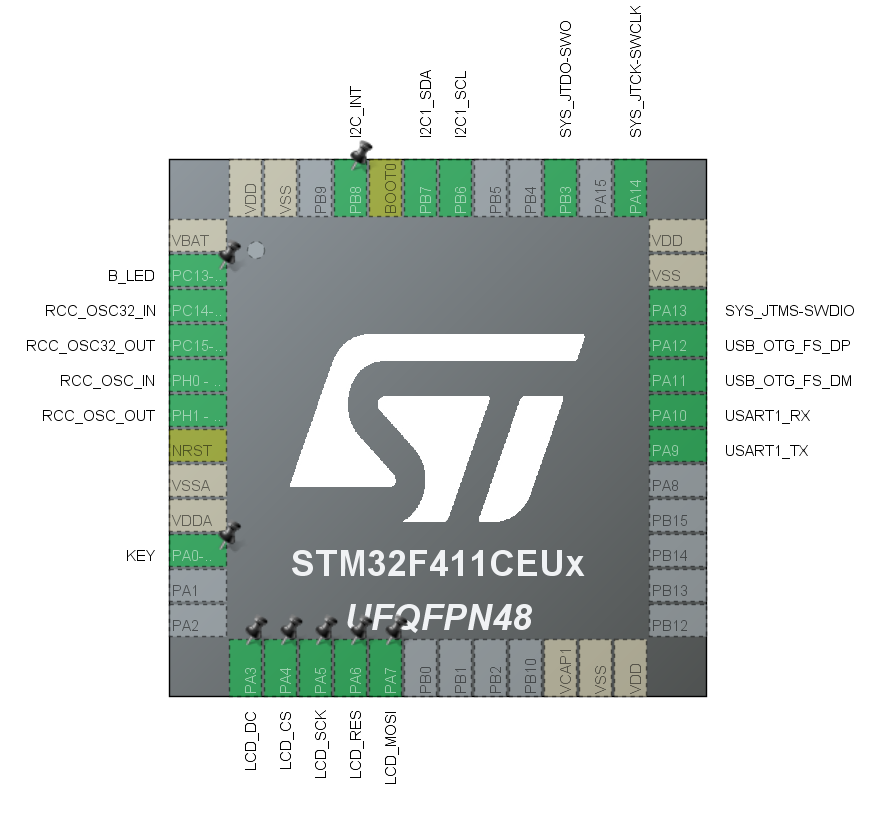
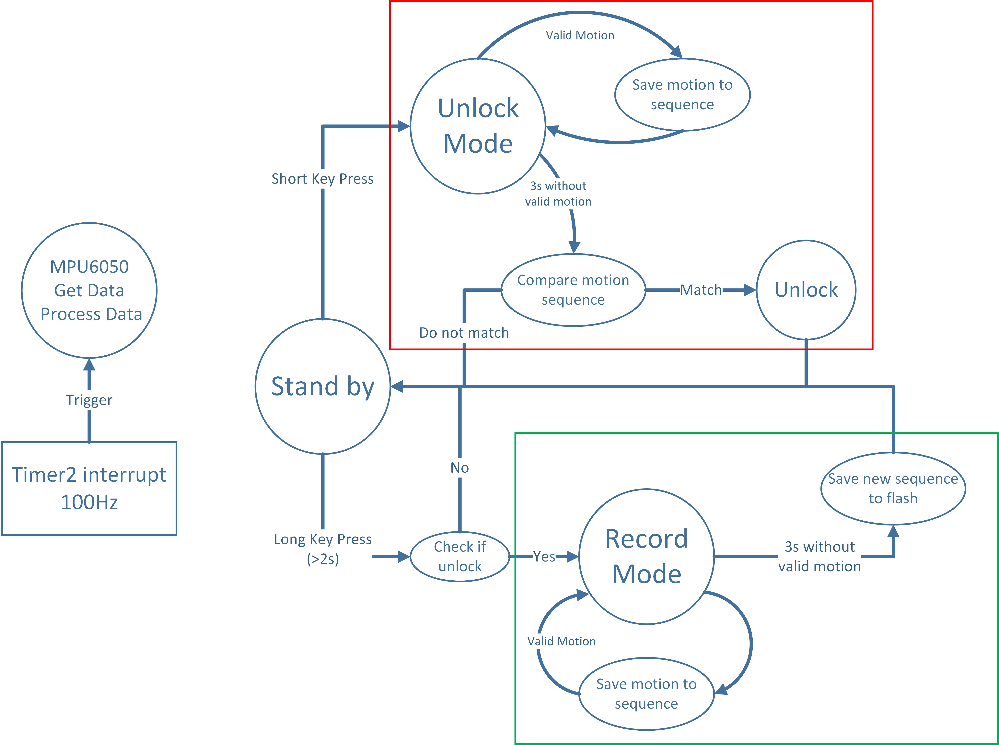
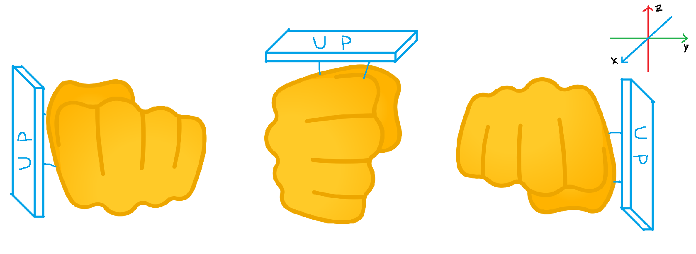
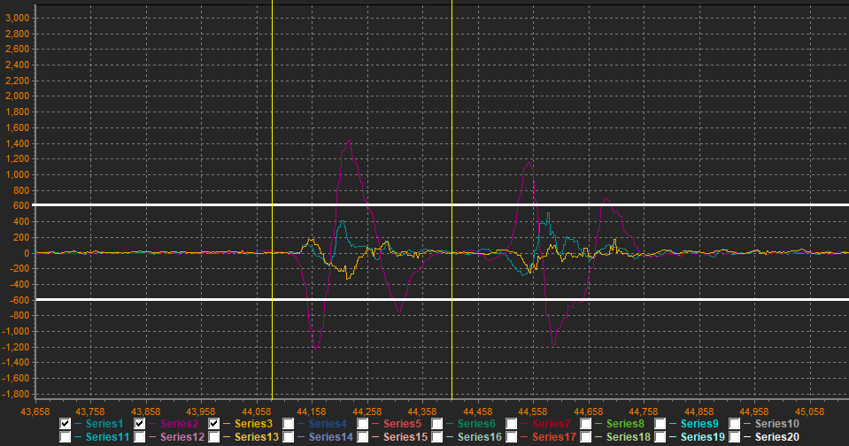
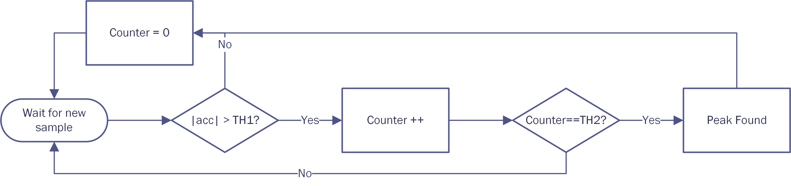
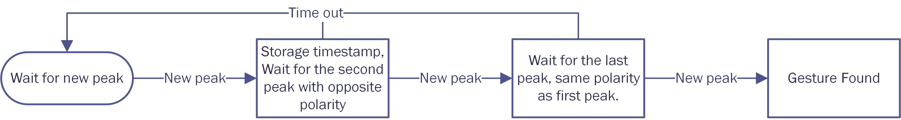
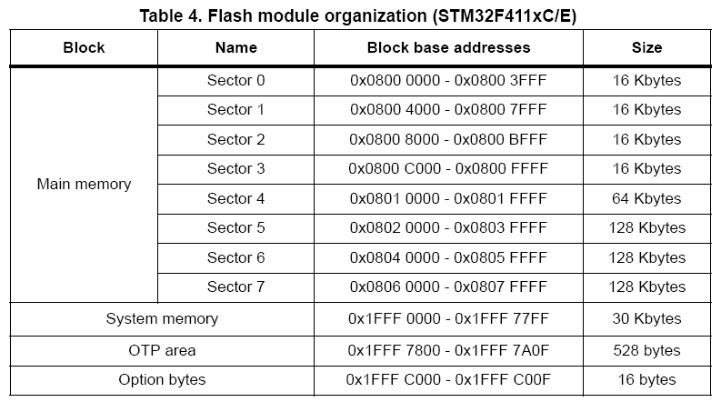

<h1 align = "center">RTES Spring 2020 Project: Gesture Lock</h1>

<b>Chengfeng Luo | cl5294</b>

.

# Objective:
- Use the data collected from a single accelerometer and/or magnetometer to
record a hand movement sequence as a means to generally “unlock” a resource.
- Recorded sequence must be saved on the microcontroller, using a “Record Key”
feature.
- User then must replicate the key sequence within sufficient tolerances to unlock
the resource.
- A successful unlock must be indicated by a visual indication, such as an LED or
similar indicator.

# Demo Video
<video src="./video.mp4" width="800px" height="600px" controls="controls"></video>

## 1. Hardware Design</h2>
### 1.1 Hardware Selection
* MCU: STM32F411CEU6
   
   * Cortex-M4 CPU up to 100MHz.
   * On-chip FPU, can faster attitude solution.
   * Small minimum system board with the same size as arduino nano.
   * Have LED and key button on board.
   

* Accelerometer: MPU6050
   
   * 6-axis motion sensor.
   * I2C communication interface.
   * Onboard DMP can dirctly output quaternions.

* Display: 0.96'' OLED module
   
   * SPI/IIC communication interface.

###1.2 Pin Configuration and Connection
* I2C1 <--> MPU6050
   
   * PB7: SDA
   * PB6: SCL
   * PB8: data ready interrupt input

* SPI1 <--> OLED
   
  * PA7: MOSI
  * PA5: SCK
  * PA4: CS
  * PA6: Reset
  * PA3: Data/Control

* LED <--> PC13
* Key <--> PA0
* UART1 <--> debug

## 2. Development Environment
I use *STM32CubeMx* for basic MCU configuration and project generation, and *keil uvision5* for IDE. 
*ST-LINK* is used for programming and debugging.

## 3. Software Design
### 3.1 Overview
Main logic of the software part show as below:

The idea is to use a simple state machine, composed by "standby" state, "unlock"(marked in red) state and "record"(marked in green) state. After initialization, system will stay in "standby" state waiting for key press. With a short key press in "standby" state, system will switch to "unlock" state and user is allow to input a sequence of *"valid gesture"* (see in 3.2). When gusture sequence is completed, wait for 3s and the program will check the sequence with the recorded one. If the sequence is matched, unlock message will be shown.
For safety reason, only after a success unlock operation, user can long press the key and enter "record" state. Similar as "unlock" state, system will wait for a sequence of *"valid gesture"*. After the sequence is completed, it will be stored into flash so the sequence will last even after reboot.

### 3.2 Gesture Alphabet
Here we define the gesture alphabet for the sequence. For the orientation of our right fist, it can be roughly defind by 3 case: palm face up, palm face left and palm face dowm. Assume our motion sensor is sit in the blue plant, the 3 different orientation can be show as:

From picture above we know the 3 kinds of orientantion have different roll angles: -90°, 0° and 90°. And in each orientation, our fist can move **forward and backward**(must return to the start point) along 6 directions in it's own frame(same frame as sensor): x+, x-, y+, y-, z+, z-. So we can set our gesture alphabet and mark then with numbers:

|             |F&B x-|F&B x+|F&B y-|F&B y+|F&B z-|F&B z++|
|-------------|:----:|:----:|:----:|:----:|:----:|:----:|
|**Palm Up**  |1     |2     |3     |4     |5     |6     |
|**Palm left**|7     |8     |9     |10    |11    |12    |
|**Palm Down**|13    |14    |15    |16    |17    |18    |
A **valid gesture** must be performed as the table above. See 3.4 for the implemention of gesture detection.
### 3.3 MPU6050 Data Processing
#### 3.3.1 Digital Motion Processor(DMP) Library Migration
Although InvenSense had offered the library for setting up it's DMP, I did not find the library that directly supports STM32 HAL. So I spent 2 days migration a library initially for MSP430 and made it work on hardware IIC via STM32 HAL. For the library code is huge and time is limited, this part of code is messy.
#### 3.3.2 Get Euler Angle
The output of DMP is quarternions, to get the roll angle we need to convert it into euler angle:
$$\begin{bmatrix} pitch \\ roll \\ yaw \end{bmatrix}=\begin{bmatrix} \arcsin(2(q_0q_2-q_1q_3)) \\ \arctan2(2(q_0q_1+q_2q_3), 1-2(q_1^2+q_2^2)) \\ \arctan2(2(q_0q_3+q_1q_2), 1-2(q_2^2+q_3^2)) \end{bmatrix}$$
Notice MPU6050's quarternion is Q30 long type and need to divide it by $2^{30}$ to get the value between -1 and 1 in float type.
#### 3.3.3 Remove Gravity Component
In order to detect the acceleration caused by moving our hand, it will make our life easier if we can remove the gravity component from the acclerometer's data. As we know, the gravity in world frame is $\begin{bmatrix}0&0&1\end{bmatrix}^T$. So respect to the sensor's frame, the gravity component can be writen as:
$$Acc_g^{sensor}=R^TAcc_g^{world}$$
Where $R$ is the rotation matrix. Use the fomular that transfroms quaternion to rotation matrix we can finally get the acceleration in xyz without gravity:
$$\begin{bmatrix} x \\ y \\ z \end{bmatrix}=\begin{bmatrix} x_{raw} \\ y_{raw} \\ z_{raw} \end{bmatrix}-\begin{bmatrix} -2(q_0q_2-q_1q_3) \\ 2(q_0q_1+q_2q_3) \\ 1-2(q_1^2+q_2^2) \end{bmatrix}$$

### 3.4 Gesture Detection
In order to know how to detect a valid gesture, let's plot the accelerate data of x,y,z:

Here is two "valid gesture" that moving along y axis. The first one is moving "forward then backward", the second one is moving "backward then forward". The y axis of the figure is acceleration in 0.001 g, and x axis is number of samples (sample rate here is set to 360Hz). From the plot, to detect the valid gesture one obvious way is counting peaks. If we see three consecutive peaks in the order of "+ - +" or "- + -" in a certain range of time, we can say that is a "valid gesture". And if some continuous samples is all larger than a threshold, we can regard there is a "peak". As the marked figure below, the white line is the threshold that determines peaks, and the yellow lines marked the duration time of a gesture, it's about 300 sample, which is around 800 ms.
With the analysis above, the algorithm for peak detection and gesture detection for one axis can be write as: 

Another observation from the plot is that although we tried to only move along one axis, it's very hard to not trigger other axises. To prevent the interfere from other two axis, besides theshold we can also record the maximun peak value within a gesture period, then select the highest one or reject the result when the maximun peak is too close. That may help to improve system's robustness. 

### 3.5 Gesture Storage
All the variables in an active program are storaged in RAM, which will be wiped off when power down. To storage the gesture key sequence we need to put it into flash. Here is the flash table of our MCU:

Notice that flash can only be erased by sectors. So we don't want to put our sequence in those sectors which have our code in it. After programming work I find out that my program is less than 64K, which means the key sequence can be put in sector 4 with the starting address 0x08010000. Each time we update the gesture key sequence we will first erase sector 4 then put the new data in.
